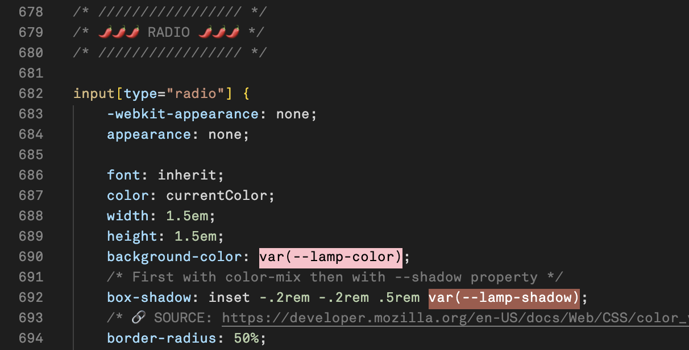

# CssControlBoard process

## Introduction

# 🤎 Week 1

## Assignment choice
For this assignment we had to choose one of the following options: 1 creating a control board website(or something that is controlled with buttons), 2 implementing a film timeline into a interactive website or 3 the interaction of a rubiks cube in a website. I choose the first as it spoke to me the most, because I can come up with many different concepts for this and because I hope it will help me better my CSS and interaction skills. For the concept of this assigment I came up with multiple idea's of controlling of manipulating things:

* Type manipulator
* Image manipulator
* Some sort of customiser
* Lamps
* Record player
* Walkmann
* Flipable calendar

First I was very excited with my type manipulator idea, but it seemed like a hard concept to actually realise. I then choose to develop my lamp idea, of the ability to control a cute lamp and its properties such as light colour, warmth, intensity and effect. 

## Moodboard

## CSS techniques

I expect to use the following CSS techniques for these reasons:
* Grid/flexbox for creating a proper lay-out
* `:has()` attribute to create 'if statements' with CSS and change website based in input
* Effects and overlays, masks and clip paths's
* Custom properties for cause and action

## Challenges
I think the biggest challenge lies in creating a visually realistic lamp with light effect in code. And adding perspective.

## Sketches

## Feedback

* Iets toevoegen, muis/gezicht
* Easter egg
* 

# 🕯️ Week 2

## Start code
I stated with some base HTML for my lay-out and build up with some standard CSS(remedy) I typically use.

## Start lamp
### Lamp top shape(8 values border radius)
For the lamp I wanted to use as little HTML as possible, therefore I used CSS with `::before` and `::after` to create multiple shapes within the same HTML element. I used the `border-radius` property with all its eight values to manipulate the border of the `div`, to create the correct lamp shape.

.png)

### Shadow top shape(background image + gradients as mask)
By using the `background-image:` property and `linear-gradient()` function to create a linear gradient that imitates a shadow on the lamp. In combination with `background-size`, `background-position`, `background-repeat: no-repeat;` and adding a second radial shadow background image on top I created the same rounding effect in the shadow as the lamp shape has.

I also added the top indent effect with two radial shadows stacked on top of each other.

.png)

### Lamp foot shape(8 values border radius)
Used `::before` to make the lamp foot with the same `border-radius` technique as with the top shape

== Used `::before` for the foot, this way it is already positioned behind the lamp neck/stand shape that is an `::after` element ==

.png)

### Lamp neck/stand shape(background image + transparent gradient)
I first tried making the stand shape with a clip path and even making my own svg, but this was not a success.

I added the stand with the `::after` selector and gradient to create two shapes with cut-outs. Achieving the desired cut-out shapes was a bit difficult to discover, but eventually a lot simpler than I anticipated.

.png)

Add image of gradient explained/drawn

I sized the `::after` element to the size I wanted it to be. After which I added two background gradients with their own cut-out on opposite sides. I wanted to achieve an 'elongated eclipse' shaped cut out, but when I sized up the transparent area(cut out) I lost most of the width in the shape, resulting in a super small neck/foot with a too short(not long/elongated enough) cut out. At first, I thought the best way to fix this was to add a third gradient in between to add some 'extra' body/width to the whole of the shape. Eventually I managed to fix this without an extra gradient, but by simply doubling the background-size to 200% and by making the cut out smaller, lowering the transparent em to 1.5em.

## The end result after week 2

## Feedback
* stack
* added 1px to gradient for smooth/blurred effect

# 🪩 Week 3

## Realistic lamp & controls
During this week I tried to make the lamp even more realistic and create a more complete scene. 

### Glow
I started by adding a realistic light glow using a simple `drop-shadow` on the lamp `
`. This also automatically added a glow to the before and after elements and so other parts of the lamp. Not neccessairly my intention but this is something I hope to fix later. *See glow at end result week 3*

### Shadow foot
For the shadow foot I once again applied the same technique of using a background image with gradient to create the illusion of a shadow. This time one shadow coming from the top of the shape and a sharp one on the bottom to create the illusion on an edge on the foot.

### Shadow stand
To make it super realistic I needed to add a shadow to the neck/stand shape. Since I already made the shape out of gradients, adding a shadow gradient on top would overlap the transparent cut-outs. I tried to think of a way to create the same cut-outs on the shadow and thought I might be able to use the `mask-image` property. I wasn't sure how to use it in such a 'complex' way so I asked Claude AI how to get my desired result. 

This made me realise I used the property wrong, but that I could in fact easily use it to create a shadow, by using the shadow as a background-image and using the mask-image property to create the neck/stand shape. So by doing things the other way around.

#### The shadow result before using mask-mage

#### The shadow result after using mask-mage

By using the gradients inside a mask I was able to create the shape into a mask using black and white. Then using the shadow gradient going from the shadow colour to the lamp colour as a background image. This way the lamp neck/stand has the shadow colour/effect and the mask with neck/stand shape is used as mask.

### Dresser
I then added a dresser with css shapes and a `transform: skewY();` effect to create the illusion of perspective. By adding a `:before` and `:after` element placing the :after more down and to the left.

### Controls
Lastly I added some controls in preparation of making the lamp and scene interactive.

## The end result after week 3

## Feedback
* 3D isometric of perspective
* CSS nesting (componenten bij elkaar houden, structuur in lezen)
* Container queries
<<<<<<< HEAD
* Typography title and optional animation

# 🥟 Week 4

## Scene, light, styled radio buttons and dresser perspective

### Light effect div
To create the effect of 'actual' light coming of the lamp I added an extra `
` styled, sized and positioned exactly the same as the mushroom lamp top. Except placing it behind the actual lamp top and making it slightly bigger and blurred with `filter: blur();`. This way it gives the illusion of light. This is also the element I intend to control with the slider by making it bigger as the slider progresses. 

To make the light effect even more realistic, I added a `::before` and `::after` element to create light coming out of the bottom of the lamp and a cast of behind the lamp.

### Styled radio buttons
Because I had never really worked with inputs before I also did not know the best way to style them. I used a source that I had also used for radio buttons during the subject browser tech. The source used `::before` and `::after` element on the radio button, which is a great way to make more and very specific styling states, but was way to complicated for what I wanted to achieve. 

Which in this case was the radio button sizing down when checked and getting a thin border plus a small inset border to give it a depth/3d effect. Which I achieved by simply styling the `:checked` state of the radio button. 

I mirrored the inset shadow position on the `:checked` state to create a small animation effect(from 2em to -2em).

To give the radio buttons the same background color as the lamp I first changed the --lamp-colour for each radio button with their colour as value. When I wanted to also change the the colour of the lamp to the same colour when the radio button was clicked, Sanne introduced me to the `attr()` CSS function and showed me how to use it to achieve the colour changing on click/:checked. By using this technique, I had to write a lot less code. See the next heading/step for further explanation.

## Change colour lamp on :checked & make the html attribute with a colour value the lamp colour
To change the colour of the lamp based on which radio button is clicked I eventually used a combination of the `:has()` function and the CSS `attr()` function. This way I had to use a lot less code.

I redefined the property `--lamp-color` in the radio button code to the value of the button that is clicked with the `attr()` function. This works because with the `attr()` function I tell the property `--lamp-color` is equal to the `value` attribute that is a type `<color>`. Also, for this to work, I had to give the values of the inputs pre-existing vs code colours. I later found out that hex codes and other ways of defining colours work as well, since the text editor reads/recognizes them as colours.

I then changed the colour of the lamp based on the radio that is clicked with `:has()`.

## Making the shadow colour adjust to the lamp colour, chrome colour, light intensity slider and light/dark mode with container style queries

### Shadow adjust to lamp colour
First used color mix, then custom property in box-shadow and adjusting the oklch values of --lamp-colour. See last rule pf code down below.

This way I did not have to define every colours shadow for each input. But I did eventually choose for a combination of the two techniques. For the ones that did not have the shadow colour I liked with oklch, I added in their own colour.

### Chrome colour
I badly wanted to create a chrome effect colour for the lamp. To achieve this I had to change the first coloured background gradient of the lamp(stand) to one with a chrome gradient. I asked Claude AI to give me a realistic chrome effect in a gradient I could use, based of an image I gave. I created a custom property with this and added this one to the stand background on click/:checked of the radio button with the value silver.

🔗 Claude's chrome gradients: https://claude.ai/chat/ef4c6603-086b-4737-a152-a32695501abd

Because I changed the custom property of the background on the lamp stand itself, the other lamp colours background was not defined and I had to create a second custom property with the default coloured background gradient. And then of course also add this custom property gradient to the stand background when a colour input is clicked/:checked.

### Light intensity slider
To make the lamp work I wanted to make it interactive and controllable with two sliders. One for the light intensity, or brightness of the lamp and one for the warmth of the light. I had to skip the last one due to lack of time, but I made the intensity slider work.

I wanted to up-size and transform the `
` the creates the illusion of light. I checked what the max size was that I wanted to give the element with the slider. Because I had never worked with input sliders before, I used Claude AI to help calculate the desired effect I wanted.

🔗 Claude AI calculations and code: https://claude.ai/share/5b199692-d931-4f2f-bfd9-c9615dd21d1d

### Light/dark mode(container style queries)
To create a light and dark mode I chose to use and practice style container queries. I added another `:has()` function that made `--dark-mode` true when a checkbox with value switch is `:checked`. 

The styling for the checkbox with `:after`

## The final result

## If I had more time on hand
If I had more/extra time on this project I would have:
* Added an on/off button for the lamp
* Properly finished the chrome lamp colour, by adding a second lamp adn switching to this second one
* Added more items to the scene, like a fun wallpaper, some books and decor and some art pieces on the wall.
* Added a light warmth slider making the light go from blue and cold to  more yellow and warm
* Styled and added more creativity to the input sliders 
* Giving the lamp a shine effect with some white shapes(maybe on hover)
* Added animation in the title with a variable font
* Added animation in the inputs label texts
* Added subtle animation to the lamp when it switched from one colour to another
* Changed the cursor to a custom one
* Added an overall grain effect/overlay to the scene

## What I learned
* Custom properties
* attr() css function
* :has()
* (Styling) inputs
* CSS shapes and gradients
* CSS effects
=======
* Typography title and animation
>>>>>>> parent of 59ceecd (Read me 🥟 Week 4)
